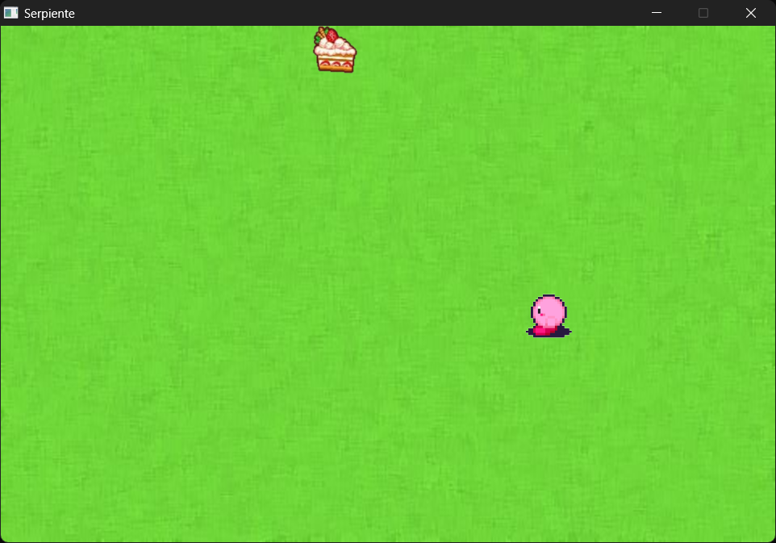

# Introducción
Este reporte describe el desarrollo de un juego de la serpiente utilizando la librería gráfica Raylib en C. Este proyecto fue realizado como parte de la materia de Paradigmas de la Programación, con el objetivo de aplicar conceptos fundamentales de programación en C, manejo de gráficos, y gestión de archivos. El juego de la serpiente es un clásico que ofrece un entorno perfecto para practicar la manipulación de matrices, la gestión de eventos y la implementación de una interfaz gráfica básica.

# Desarrollo
## Estructura del Proyecto
El proyecto está dividido en varias secciones clave:

- Definición de constantes y variables globales.
- Declaración de funciones auxiliares para manejar el ranking.
- Inicialización de recursos gráficos y de audio.
- Bucle principal del juego que gestiona los diferentes estados del juego: menú, juego, final, y ranking.
- Liberación de recursos al finalizar el juego.

## Constantes y Variables Globales
Se definieron varias constantes para manejar el tamaño de los elementos en el juego y las dimensiones del tablero:

    #define TAMANO_CUADRO 64
    #define FILAS 15
    #define COLUMNAS 10

Además, se definieron variables globales para gestionar el estado del juego, la posición de la comida y la serpiente, la dirección de la serpiente, entre otros.

## Funciones Auxiliares
Se implementaron tres funciones principales para manejar el sistema de ranking:

- updateRanking(int newScore): Actualiza el ranking con una nueva puntuación.
- loadRanking(): Carga el ranking desde un archivo.
- saveRanking(): Guarda el ranking en un archivo.

Estas funciones permiten que el juego mantenga un registro de las mejores puntuaciones alcanzadas por el jugador.

## Inicialización de Recursos
En la función main(), se inicializan los recursos gráficos y de audio:

    InitWindow(FILAS * TAMANO_CUADRO, COLUMNAS * TAMANO_CUADRO, "Serpiente");
    InitAudioDevice();
    SetTargetFPS(60);

Se cargan las texturas y sonidos necesarios para el juego:

    Texture2D backgroundImage = LoadTexture("path_to_menu_image");
    Texture2D loseImage = LoadTexture("path_to_lose_image");
    Texture2D snakeUp = LoadTexture("path_to_snake_up_image");
    ...
    Music music = LoadMusicStream("path_to_background_music");
    Sound eatSound = LoadSound("path_to_eat_sound");
    Sound losingSound = LoadSound("path_to_lose_sound");

## Bucle Principal del Juego
El bucle principal maneja los diferentes estados del juego usando una variable currentScreen:

while (!WindowShouldClose())
{
    UpdateMusicStream(music);

    BeginDrawing();
    ClearBackground(BLACK);

    if (currentScreen == TITLE) {
        // Código para mostrar el menú principal
    }
    else if (currentScreen == GAME) {
        // Código para el estado de juego en curso
    }
    else if (currentScreen == END) {
        // Código para mostrar la pantalla de fin de juego
    }
    else if (currentScreen == RANKING) {
        // Código para mostrar la pantalla de ranking
    }

    EndDrawing();
}

Este bucle permite cambiar entre las pantallas del menú, el juego, el final del juego, y el ranking según las acciones del jugador.

## Gestión del Estado del Juego
En el estado del juego (GAME), se actualiza la posición de la serpiente, se comprueba si ha comido la fruta, y se verifica si ha colisionado con los bordes o consigo misma. Si se cumple alguna condición de derrota, se actualiza el ranking y se cambia al estado de fin del juego (END).

## Liberación de Recursos
Al finalizar el juego, se liberan los recursos gráficos y de audio:

    UnloadMusicStream(music);
    UnloadSound(eatSound);
    CloseAudioDevice();
    UnloadTexture(backgroundImage);
    UnloadTexture(loseImage);
    ...
    CloseWindow();

## Pantallas
A continuación se muestran pantallas del juego en reproducción:

# Conclusión
El desarrollo de este juego de la serpiente en C utilizando Raylib ha permitido aplicar y reforzar conocimientos de programación, manejo de gráficos y audio, así como gestión de archivos. La implementación de diferentes estados del juego y un sistema de ranking proporcionan una experiencia de usuario completa y satisfactoria. Este proyecto no solo sirve como una excelente práctica de programación, sino también como una base sobre la cual se pueden añadir funcionalidades y complejidades adicionales en el futuro.

