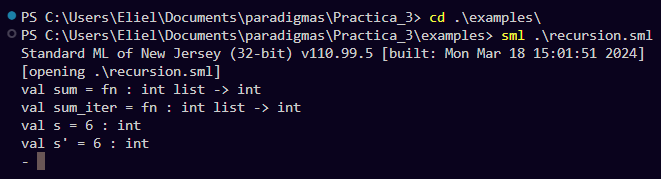
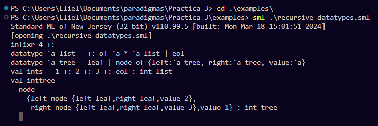
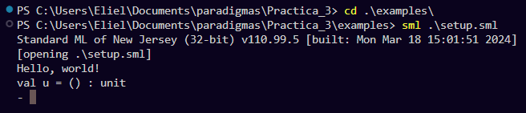

# Introducción

En el curso de Paradigmas de la Programación, hemos explorado diferentes lenguajes y enfoques para resolver problemas computacionales. Uno de estos lenguajes es Standard ML (SML), un lenguaje funcional que enfatiza la inmutabilidad, la expresión matemática y el uso de funciones como elementos primarios. En este reporte, presentaremos una visión general de SML, su funcionamiento y la lógica detrás de su diseño. También discutiremos algunos ejemplos prácticos para ilustrar su uso y finalizaremos con una conclusión que resuma nuestra experiencia y aprendizajes con este lenguaje.

# Desarrollo

## Fundamentos de Standard ML
Standard ML es un lenguaje de programación de tipo funcional, conocido por su fuerte tipado estático, inferencia de tipos y su diseño orientado a la corrección de programas. Fue desarrollado inicialmente a finales de los años 80 como parte de un esfuerzo para crear un lenguaje limpio y eficiente que soportara tanto la programación funcional como la programación modular.

## Sintaxis y Tipos

Uno de los aspectos más destacados de SML es su sintaxis concisa y su sistema de tipos robusto. Por ejemplo, una función simple para sumar dos números se define de la siguiente manera:

    fun sumar (x: int, y: int): int = x + y;

La palabra clave fun define una nueva función, y los tipos de los argumentos y el tipo de retorno se especifican explícitamente. No obstante, SML también es capaz de inferir tipos automáticamente, lo que simplifica el código para funciones más sencillas:

    fun sumar x y = x + y;

## Listas y Patrones

Las listas son estructuras de datos fundamentales en SML. Aquí hay un ejemplo de una función que calcula la longitud de una lista utilizando recursión y coincidencia de patrones (pattern matching):

    fun longitud [] = 0
    | longitud (_::resto) = 1 + longitud resto;

En este ejemplo, [] representa una lista vacía y (_::resto) representa una lista con al menos un elemento, donde :: es el operador de cons. La coincidencia de patrones permite descomponer las estructuras de datos de manera clara y concisa.

## Módulos y Abstracción

SML soporta la programación modular mediante el uso de estructuras y firmas. Una estructura es una colección de definiciones de tipos y valores, mientras que una firma define una interfaz que una estructura debe cumplir. Por ejemplo:

    signature PILA = 
    sig
    type 'a pila
    val vacia: 'a pila
    val apilar: 'a * 'a pila -> 'a pila
    val desapilar: 'a pila -> 'a pila
    val cima: 'a pila -> 'a
    end;

    structure Pila : PILA = 
    struct
    type 'a pila = 'a list
    val vacia = []
    fun apilar (x, p) = x :: p
    fun desapilar (_::resto) = resto
        | desapilar [] = raise Empty
    fun cima (x::_) = x
        | cima [] = raise Empty
    end;

Aquí, la firma PILA define las operaciones de una pila genérica, mientras que la estructura Pila implementa estas operaciones utilizando listas.

## Funciones y Composiciones

Las funciones en SML son ciudadanos de primera clase, lo que significa que pueden ser pasadas como argumentos, retornadas por otras funciones y almacenadas en estructuras de datos. Esta capacidad es central para la programación funcional y facilita la creación de programas más flexibles y reutilizables.

Un ejemplo común es el uso de funciones de orden superior, que toman otras funciones como argumentos:

    fun aplicar_dos_veces f x = f (f x);

    val duplicar = fn x => x * 2;
    val resultado = aplicar_dos_veces duplicar 3; (* resultado es 12 *)

En este ejemplo, aplicar_dos_veces toma una función f y un valor x, y aplica f a x dos veces.

## Aplicación

En la carpeta examples hay contenidas una gran cantidad de ejemplos de programas de SML. A continuación se motrara algunos de los programas contenidos:

## recursion.sml
    fun sum []        = 0
    | sum (x :: xs) = x + sum xs

    fun sum_iter xs =
    let fun sum_iter' [] acc        = acc
            | sum_iter' (x :: xs) acc = sum_iter' xs (x + acc)
    in sum_iter' xs 0
    end

    val s = sum [1, 2, 3]
    val s' = sum_iter [1, 2, 3]

## recursive_datatypes.sml
    infixr 4 +:
    datatype 'a list = eol
                    | +: of 'a * 'a list

    datatype 'a tree = leaf
                    | node of { value : 'a
                            , left  : 'a tree
                            , right : 'a tree
                            }

    val ints = 1 +: 2 +: 3 +: eol
    val inttree = node { value = 1
                    , left  = node { value = 2
                                    , left = leaf
                                    , right = leaf
                                    }
                    , right = node { value = 3
                                    , left = leaf
                                    , right = leaf
                                    }
                    }

## setup.sml
    val u = print "Hello, world!\n"

# Conclusión

Standard ML es un lenguaje poderoso que ofrece una gran cantidad de herramientas para la programación funcional y modular. Su sistema de tipos fuerte y la inferencia de tipos permiten escribir código seguro y conciso. A través de este ejercicio, hemos explorado cómo SML maneja funciones, listas, módulos y la composición de funciones. El enfoque de SML en la claridad y la corrección proporciona una base sólida para desarrollar software fiable y eficiente. La práctica con SML no solo nos ha proporcionado una comprensión más profunda de la programación funcional, sino que también ha mejorado nuestras habilidades en la abstracción y la manipulación de estructuras de datos. En resumen, Standard ML es una adición valiosa a nuestro repertorio de lenguajes de programación y nos prepara mejor para abordar una variedad de problemas computacionales de manera elegante y efectiva.
